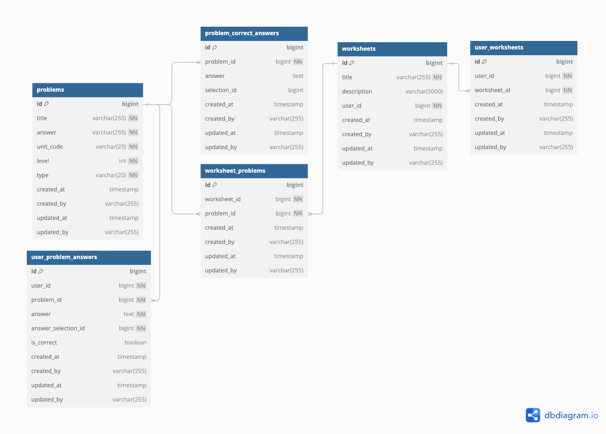

# 풀리 백엔드 과제

## ERD

- problems : 문제 테이블
- problem_correct_answers : 문제 정답 테이블
- worksheets : 문제지 테이블
- worksheet_problems : 문제지 - 문제 매핑 테이블
- user_worksheets : 유저에게 출제된 문제지 테이블
- user_problem_answers : 유저가 푼 문제 답안 테이블 

참고로 User, Selection (객관식 항목 테이블) 테이블은 ID 값만 필드에 추가하고 테이블은 따로 생성하지 않았습니다.  

## API 명세서 

[링크](https://documenter.getpostman.com/view/18460012/2sAYQXosx5#49c21158-3119-4353-8f9e-2f022a144b9e)

## 문제 해결 전략

- 해당 프로젝트에서 발생할 수 있는 위험요소

1. 문제점 : 느린 API 응답 및 과도한 메모리 로드로 인한 서버 장애 

현 프로젝트의 위험 요소 중 하나는 실시간으로 제공되는 학습지 학습 통계 분석 조회 API 입니다. 해당 기능은 학생 개별 학습지 정답률 및 문제별 정답률 등 여러 데이터를 분석해야 하는 작업을 포함합니다. 이는 대량의 데이터를 메모리에 로드하여 처리해야 하므로, 다음과 같은 문제가 발생할 수 있습니다.

- API 응답 속도 저하: 실시간 통계 처리는 복잡도가 높아, 사용자 경험에 부정적 영향을 미칠 정도로 응답이 지연될 수 있습니다.
- OOM(Out of Memory) 위험: 대량 데이터를 메모리에 로드하면, 서버 메모리가 초과되어 장애 상황을 초래할 가능성이 높습니다. 예를 들어, 1만 명의 학생이 각각 100개의 문제를 제출할 경우, 약 100만 개의 데이터를 처리해야 합니다. 데이터 증가에 따라 메모리 사용량이 기하급수적으로 증가하며, 이는 곧 시스템 불안정성을 초래합니다.

2. 해결방안 : 모니터링 및 통계 분석을 위한 최적화된 배치 서버 구축

- 배치 서버를 통한 분리된 처리: 대용량 데이터를 처리해야 하는 통계 분석 작업은 실시간 처리 대신, 배치 서버에서 비동기적으로 처리하는 방식을 채택해야 합니다. 이를 통해 다음과 같은 이점을 얻을 수 있습니다.
  - WAS의 실시간 부하를 줄이고 응답 속도를 향상시킬 수 있습니다.
  - 통계 결과를 사전에 계산하여 캐싱하거나, 결과 데이터를 별도 DB 테이블에 저장해두면 API 호출 시 빠르게 응답을 제공할 수 있습니다.

---

3. 문제점 : 별도의 인증 및 인가 처리 없이 API 호출 시 데이터 접근 가능

- 현 프로젝트는 별도의 인증 및 인가 처리 없이 API 호출이 가능하여, 보안 상 리스크가 존재합니다. 특히, 학습 분석 통계와 같은 민감한 데이터가 외부에 노출될 경우, 사용자 정보 유출이나 데이터 오남용과 같은 심각한 문제가 발생할 수 있습니다. 이러한 문제는 서비스 신뢰도에도 악영향을 미칠 수 있습니다.

4. 해결방안 : Spring Security를 통한 인증 및 인가 처리

- 이 문제를 해결하기 위해 Spring Security를 활용하여 API 호출에 인증 및 인가 절차를 추가하는 것이 필요합니다. 구체적인 방안은 아래와 같습니다.
  - JWT(Json Web Token)를 활용한 토큰 기반 인증
    - 사용자가 로그인 시 JWT 토큰을 발급받아 API 호출마다 이를 전달하도록 설계합니다.
토큰을 검증하여 요청을 보낸 사용자가 올바른 인증 절차를 거쳤는지 확인할 수 있습니다.
  - 역할 기반 권한 제어(RBAC, Role-Based Access Control)
    - 사용자 권한에 따라 호출 가능한 API를 제한합니다.
    - 예를 들어, 학생은 학습지 제출 API만 호출할 수 있도록 권한을 제한. 관리자는 학습지 생성 및 통계 데이터 조회와 같은 관리 API 호출 권한 부여.
  - 보안 설정 강화
    - 추가로 HTTPS를 사용해 네트워크 상에서 전송되는 데이터를 암호화 할 필요가 있습니다. 이를 통해, 중간에 데이터가 탈취되더라도, 유출을 방지할 수 있습니다.
