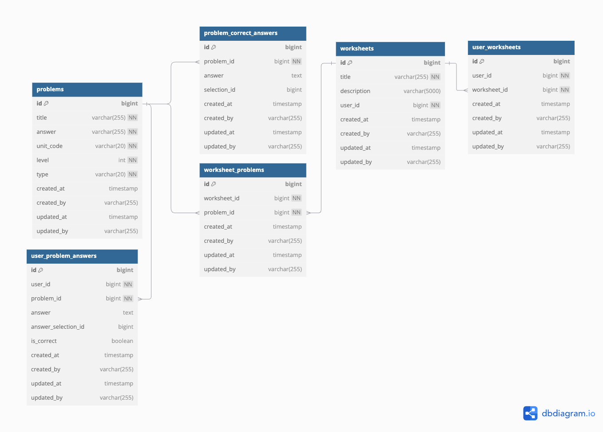

# 풀리 백엔드 과제

## 순서

1. **Redis 서버 시작**: 먼저 로컬 머신에서 Redis 서버를 시작해야 합니다. Redis 서버가 시작되면 애플리케이션은 Redis를 사용하여 분산 락을 구현합니다.
2. **애플리케이션 실행**: 다음 명령을 사용하여 애플리케이션을 실행할 수 있습니다:
3. **API 호출**: Postman API 문서를 사용하여 이러한 API를 호출할 수 있습니다.
    - Postman API 문서 : https://documenter.getpostman.com/view/18460012/2sAYQXosx5#49c21158-3119-4353-8f9e-2f022a144b9e

## ERD



- problems : 문제 테이블
- problem_correct_answers : 문제 정답 테이블
- worksheets : 문제지 테이블
- worksheet_problems : 문제지 - 문제 매핑 테이블
- user_worksheets : 유저에게 출제된 문제지 테이블
- user_problem_answers : 유저가 푼 문제 답안 테이블 

참고로 User, Selection (객관식 항목 테이블) 테이블은 ID 값만 필드에 추가하고 테이블은 따로 생성하지 않았습니다.  

## API 명세서 

[링크](https://documenter.getpostman.com/view/18460012/2sAYQXosx5#49c21158-3119-4353-8f9e-2f022a144b9e)

## 문제 해결 전략

- 해당 프로젝트에서 발생할 수 있는 위험요소

### 문제점 : 느린 API 응답 및 과도한 메모리 로드로 인한 서버 장애 

현 프로젝트의 위험 요소 중 하나는 실시간으로 제공되는 학습지 학습 통계 분석 조회 API 입니다. 해당 기능은 학생 개별 학습지 정답률 및 문제별 정답률 등 여러 데이터를 분석해야 하는 작업을 포함합니다. 이는 대량의 데이터를 메모리에 로드하여 처리해야 하므로, 다음과 같은 문제가 발생할 수 있습니다.

- API 응답 속도 저하: 실시간 통계 처리는 복잡도가 높아, 사용자 경험에 부정적 영향을 미칠 정도로 응답이 지연될 수 있습니다.
- OOM(Out of Memory) 위험: 대량 데이터를 메모리에 로드하면, 서버 메모리가 초과되어 장애 상황을 초래할 가능성이 높습니다. 예를 들어, 1만 명의 학생이 각각 100개의 문제를 제출할 경우, 약 100만 개의 데이터를 처리해야 합니다. 데이터 증가에 따라 메모리 사용량이 기하급수적으로 증가하며, 이는 곧 시스템 불안정성을 초래합니다.

### 해결방안 : 모니터링 및 통계 분석을 위한 최적화된 배치 서버 구축

- 배치 서버를 통한 분리된 처리: 대용량 데이터를 처리해야 하는 통계 분석 작업은 실시간 처리 대신, 배치 서버에서 비동기적으로 처리하는 방식을 채택해야 합니다. 이를 통해 다음과 같은 이점을 얻을 수 있습니다.
  - WAS의 실시간 부하를 줄이고 응답 속도를 향상시킬 수 있습니다.
  - 통계 결과를 사전에 계산하여 캐싱하거나, 결과 데이터를 별도 DB 테이블에 저장해두면 API 호출 시 빠르게 응답을 제공할 수 있습니다.

---

### 문제점 : 별도의 인증 및 인가 처리 없이 API 호출 시 데이터 접근 가능

- 현 프로젝트는 별도의 인증 및 인가 처리 없이 API 호출이 가능하여, 보안 상 리스크가 존재합니다. 특히, 학습 분석 통계와 같은 민감한 데이터가 외부에 노출될 경우, 사용자 정보 유출이나 데이터 오남용과 같은 심각한 문제가 발생할 수 있습니다. 이러한 문제는 서비스 신뢰도에도 악영향을 미칠 수 있습니다.

### 해결방안 : Spring Security를 통한 인증 및 인가 처리

- 이 문제를 해결하기 위해 Spring Security를 활용하여 API 호출에 인증 및 인가 절차를 추가하는 것이 필요합니다. 구체적인 방안은 아래와 같습니다.
  - JWT(Json Web Token)를 활용한 토큰 기반 인증
    - 사용자가 로그인 시 JWT 토큰을 발급받아 API 호출마다 이를 전달하도록 설계합니다.
토큰을 검증하여 요청을 보낸 사용자가 올바른 인증 절차를 거쳤는지 확인할 수 있습니다.
  - 역할 기반 권한 제어(RBAC, Role-Based Access Control)
    - 사용자 권한에 따라 호출 가능한 API를 제한합니다.
    - 예를 들어, 학생은 학습지 제출 API만 호출할 수 있도록 권한을 제한. 관리자는 학습지 생성 및 통계 데이터 조회와 같은 관리 API 호출 권한 부여.
  - 보안 설정 강화
    - 추가로 HTTPS를 사용해 네트워크 상에서 전송되는 데이터를 암호화 할 필요가 있습니다. 이를 통해, 중간에 데이터가 탈취되더라도, 유출을 방지할 수 있습니다.

---

### 문제점 : 동시성 문제로 인한 데이터 정합성 문제

- 본 프로젝트는 학생이 동시에 여러 문제를 제출할 수 있는 기능을 제공합니다. 이는 동시성 문제로 인해 데이터 정합성 문제가 발생할 수 있습니다. 예를 들어, 동일한 문제를 동시에 제출할 경우, 데이터가 중복 저장되는 등 데이터 정합성이 깨질 수 있습니다.

### 해결방안 : 멀티 유니크 키 적용 및 분산락을 통한 동시성 제어

- 기본적으로 DB 에서 유니크 키를 적용하여 중복 데이터가 저장되지 않도록 해줍니다.
- 또한 동일한 자원에 동시에 접근하지 못하도록, 현재 구조에서는 분산락을 통해 동시성 문제를 해결합니다. 예를 들어, 동일한 문제를 동시에 제출할 경우, 해당 문제에 대한 락(RedisLock)을 걸어 다른 요청이 해당 데이터에 접근하지 못하도록 합니다. 이를 통해 데이터 정합성을 유지할 수 있습니다. 
- 비관적 락을 사용하거나 낙관적 락을 사용할 수도 있지만, 분산락을 사용한 이유는 확장성과 성능 때문 입니다. 별도 레디스 서버를 활용하여, 락을 획득하기 때문에 분산 환경으로 확장되더라도 데이터 정합성을 유지할 수 있기 있습니다. 또한 DB 락을 사용하지 않으므로 DB 부하를 줄일 수 있습니다.
- 또한, 락을 획득한 후, 해당 락이 만료되지 않는 경우를 대비하여, 락 만료 시간을 설정하여 락이 만료되면 다른 요청이 해당 데이터에 접근할 수 있도록 합니다.

## 참고

### 로컬 Redis 설정 (MacOS)

1. **Redis 설치**: 먼저 로컬 머신에 Redis를 설치해야 합니다. macOS를 사용하는 경우 Homebrew를 사용하여 Redis를 설치할 수 있습니다:

```bash
brew install redis
```

다른 운영 체제의 경우 [공식 Redis 웹사이트](https://redis.io/download)에서 Redis를 다운로드하고 설치 지침을 따르세요.

2. **Redis 서버 시작**: Redis가 설치되면 다음 명령을 사용하여 Redis 서버를 시작할 수 있습니다:

```bash
redis-server
```

기본적으로 Redis는 6379 포트에서 실행됩니다.

3. **Redis 설치 테스트**: 다음 명령을 사용하여 Redis 명령줄 인터페이스를 실행하여 Redis가 제대로 작동하는지 테스트할 수 있습니다:

```bash
redis-cli ping
```

Redis가 제대로 작동하면 `PONG`이 반환됩니다.

### 로컬 Redis 설정 (Windows)

1. **Redis 설치**: 먼저 로컬 머신에 Redis를 설치해야 합니다. Windows를 사용하는 경우 다음 단계를 따르세요:

  - [Redis Windows 공식 다운로드 페이지](https://github.com/microsoftarchive/redis/releases)에서 최신 버전의 Redis를 다운로드합니다.
  - 다운로드한 zip 파일을 원하는 위치에 압축 해제합니다.
  - 압축 해제한 디렉토리로 이동하여 `redis-server.exe` 파일을 실행합니다.

2. **Redis 서버 시작**: Redis가 설치되면 다음 명령을 사용하여 Redis 서버를 시작할 수 있습니다:

```bash
redis-server.exe
```

기본적으로 Redis는 6379 포트에서 실행됩니다.

3. **Redis 설치 테스트**: 다음 명령을 사용하여 Redis 명령줄 인터페이스를 실행하여 Redis가 제대로 작동하는지 테스트할 수 있습니다:

```bash
redis-cli.exe ping
```

Redis가 제대로 작동하면 `PONG`이 반환됩니다.